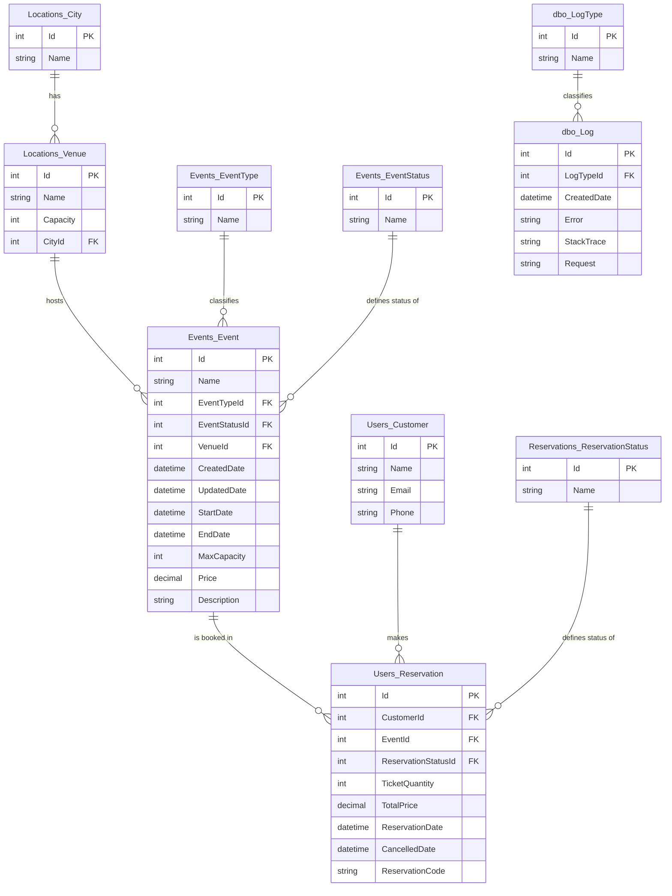

# Data Model — EventosVivos Reservation System

This document defines the final database model and the reasoning behind every non-obvious design decision. It is the source of truth for generating Entities, DTOs, Services, Repositories, and Controllers — any code generation should follow this model exactly rather than re-deriving it from the raw requirements.

## Entity-Relationship Diagram



## Design decisions and rationale

### 1. No ticket counters on `Events_Event`

The model does **not** include fields like `TicketsSold` or `TicketsBlocked` on the Event entity. Availability is always calculated dynamically from `Users_Reservation`, grouped by `ReservationStatusId`, instead of being maintained as a separately stored counter.

**Why**: a stored counter requires every operation that changes a reservation's status (create, confirm, cancel, release from `Lost`) to also update the Event's counter inside the same transaction. Missing or failing to wrap any of these in a transaction creates a real risk of the counter drifting from reality — exactly the kind of edge case the test explicitly asks to handle carefully. A dynamic calculation has a single source of truth and cannot drift, at negligible performance cost given this project's scale.

**Calculation logic** (used in the Service layer, not persisted):
```
ticketsSold     = SUM(TicketQuantity) WHERE ReservationStatusId = Confirmed
ticketsBlocked  = SUM(TicketQuantity) WHERE ReservationStatusId = PendingPayment
ticketsLost     = SUM(TicketQuantity) WHERE ReservationStatusId = Lost
availableTickets = Event.MaxCapacity - ticketsSold - ticketsBlocked - ticketsLost
```

`PendingPayment` blocks availability (counts against capacity) — a reservation has already claimed those tickets even though payment isn't confirmed yet. This prevents two customers from reserving the same last-available tickets simultaneously.

### 2. `Events_EventStatus` only needs `Active` and `Cancelled`

`Completed` (BR-06) is **not** a value that gets persisted and updated by a job or scheduled process. It is calculated dynamically by comparing `Events_Event.EndDate` against the current date/time whenever the status needs to be evaluated (on a query, or when validating a business rule). This avoids needing any background scheduler for the scope of this test.

When exposing an event's status (e.g., in FR-02 listing or FR-06 reporting), the Service layer must combine the persisted `EventStatusId` (`Active`/`Cancelled`) with this dynamic check: if `EventStatusId = Active` AND `EndDate < Now`, the effective status shown is `Completed`.

### 3. `Reservations_ReservationStatus` has four values, not three plus a boolean

Values: `PendingPayment`, `Confirmed`, `Cancelled`, `Lost`.

**Why not a boolean flag on top of `Cancelled`**: BR-07's penalty isn't a simple flag — it changes how the reservation is treated in availability calculations and in the occupancy report (FR-06). Modeling it as a distinct status value, rather than `Cancelled` + `IsLostPenalty = true`, keeps the state machine explicit and avoids ambiguity about what "cancelled" means in each context.

**State transitions:**
```
PendingPayment → Confirmed   (FR-04: payment confirmed)
Confirmed      → Cancelled   (FR-05: cancelled ≥48h before event start — tickets released)
Confirmed      → Lost        (FR-05 + BR-07: cancelled <48h before event start — tickets NOT released)
Lost           → Cancelled   (manual admin action: tickets are released for resale)
```

Only `Confirmed` reservations can be cancelled (per FR-05); attempting to cancel a `PendingPayment` or already-`Cancelled`/`Lost` reservation must raise the appropriate business exception.

### 4. Effect of each status on ticket availability

| Status | Blocks availability? | Counts as "sold" in FR-06? | Released on cancellation? |
|---|---|---|---|
| `PendingPayment` | Yes | No | N/A |
| `Confirmed` | Yes | Yes | N/A |
| `Cancelled` | No | No | Yes — tickets become available again |
| `Lost` | Yes (until manually released) | No | No — until an admin manually transitions it to `Cancelled` |

### 5. No duplicated event date on `Users_Reservation`

BR-04 (no reservations within 1 hour of event start) and the 24h rule in FR-03 are validated **before** a reservation is created, by joining to `Events_Event.StartDate` at validation time. If a `Users_Reservation` row exists, it has already passed that check — there is no need to duplicate `StartDate` onto the reservation for later re-validation.

### 6. `CancelledDate` on `Users_Reservation`

Added explicitly to satisfy FR-05's requirement to record the cancellation date/time. Nullable — only populated when a reservation transitions to `Cancelled` or `Lost`.

### 7. Removed: `Events_TypeStatus` intermediate table

The original draft included a `TypeStatus` catalog meant to distinguish "types of status." Once Event status and Reservation status were split into two independent catalogs (`Events_EventStatus` and `Reservations_ReservationStatus`), this intermediate table no longer serves a purpose and was removed.

### 8. AutoMapper profile location

Entity ↔ DTO mapping profiles live in `App.Infrastructure` (not `App.Common`), since a mapping profile needs visibility of both the Entities (Infrastructure) and the DTOs (Common). This keeps `App.Common` free of any dependency on other layers, per the dependency direction defined in `ARCHITECTURE.md`.

## English naming reference

| Spanish (requirements) | Entity / field in code |
|---|---|
| Evento | `Events_Event` |
| Reserva | `Users_Reservation` |
| Venue | `Locations_Venue` |
| Ciudad | `Locations_City` |
| Cliente / comprador | `Users_Customer` |
| Tipo de evento | `Events_EventType` |
| Estado del evento | `Events_EventStatus` |
| Estado de la reserva | `Reservations_ReservationStatus` |
| pendiente_pago | `PendingPayment` |
| confirmada | `Confirmed` |
| cancelada | `Cancelled` |
| perdida (BR-07) | `Lost` |
| activo | `Active` |
| completado | `Completed` (calculated, not persisted) |

## Reference data (seeded on startup)

**Locations_City:**
| Id | Name |
|---|---|
| 1 | Bogotá |
| 2 | Medellín |

**Locations_Venue:**
| Id | Name | Capacity | CityId |
|---|---|---|---|
| 1 | Auditorio Central | 200 | 1 |
| 2 | Sala Norte | 50 | 1 |
| 3 | Arena Sur | 500 | 2 |

**Events_EventType:**
| Id | Name |
|---|---|
| 1 | Conference |
| 2 | Workshop |
| 3 | Concert |

**Events_EventStatus:**
| Id | Name |
|---|---|
| 1 | Active |
| 2 | Cancelled |

**Reservations_ReservationStatus:**
| Id | Name |
|---|---|
| 1 | PendingPayment |
| 2 | Confirmed |
| 3 | Cancelled |
| 4 | Lost |
